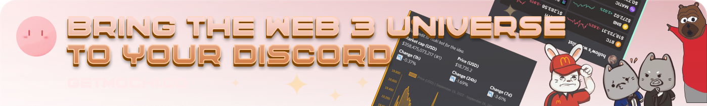
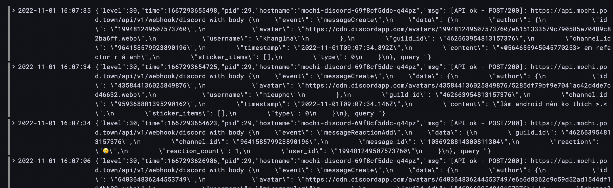
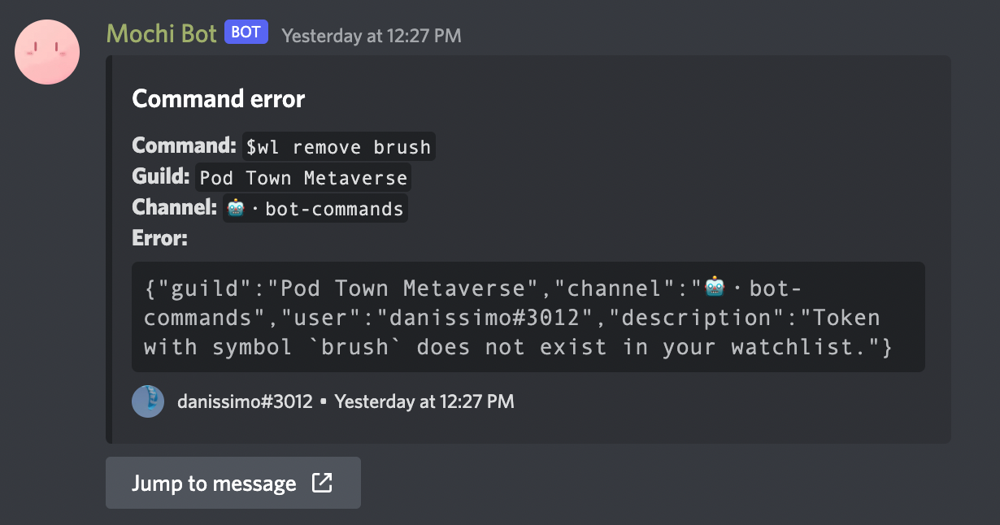

<p align="center" style="font-size: 32px; font-weight: bold; width: 40%; margin: 0 auto">Mochi Bot</p>
<a style="margin-top: 20px;display: flex;justify-content: center" href="https://getmochi.co">
  
</a>

<p align="center" style="margin: 15px 20%">

<a href="https://github.com/consolelabs/mochi-discord/tags">

</a>

<a href="https://github.com/consolelabs/mochi-discord/blob/main/LICENSE">

</a>
<a href="https://discord.gg/DMVyp5Fr8Q">

</a>


<a href="https://twitter.com/getmochi_bot">

</a>
</p>

## :gear: Setup

If you're already familiar with the discord bot development workflow, skip right to step 8, otherwise follow these steps below:

1. Go to the [Discord Developer Portal](https://discord.com/login?redirect_to=%2Fdevelopers%2Fapplications) and login (register an account if needed)
2. On the top right corner, click New Application to create a new application
3. On the left side menu, the General Information displays information about your application, notice the Application ID, you will need it later
4. Navigate to Bot tab > Add Bot
5. After adding you will see the Token for your bot, note it down, you will need it later
6. At the Privileged Gateway Intents, enable all 3 options, bot permission is Administrator (8)
7. To add the bot for local development, [copy this link](https://discord.com/api/oauth2/authorize?client_id=${APPLICATION_ID}&permissions=8&scope=bot%20applications.commands) and replace the `APPLICATION_ID` in the url with your application id
8. Enable dev mode in Discord, this basically lets you copy id of a bunch of things (channels, guilds, messages, etc...). To do it, navigate to Setting > Advanced > Developer Mode > Enable
9. Finally, send your guild's id to one of the member of Console Labs (if you're developing locally but using the staging api endpoint)

This step is optional, if you can run the source, great. If not, it might be related to canvas native libraby because Mochi internally uses a canvas dependency to render response

10. Install pkg needed for canvas if needed: `brew install pkg-config cairo pango libpng jpeg giflib librsvg`

## :recycle: Environment Variables

<details>
  <summary>Show table</summary>
  
  | Required | Name | Description |
  | --- | --- | --- |
  | ✅ | `DISCORD_TOKEN` | Without this the bot cannot run. To get one, refer to [Setup](#setup) |
  | ✅ | `APPLICATION_ID` | Used to register slash commands on bot startup. To get one, refer to [Setup](#setup) |
  | ✅ | `API_SERVER_HOST` | Base API endpoint for most of Mochi's command, for detail see [API](#api) |
  | ✅ | `INDEXER_API_SERVER_HOST` | Indexer API endpoint for Mochi's profile command, for detail see [API](#api) |
  |  | `PT_API_SERVER_HOST` | Specific API of Pod Town, used to integrate new character into the verse |
  |  | `LOCAL_EXPERIMENTAL_CATEGORY_ID` | Experimental category id for when developing experimental command, for more detail see [Experimental commands](#experimental-commands) |
  |  | `MOCHI_GUILD_ID` | The guild where all Mochi's internal logs are sent to, default to the Web3 Console guild. If you're developing locally, you should set it to your test guild's id |
  |  | `LOG_CHANNEL_ID` | All logs are sent to this channel, set to your test channel if developing locally |
  |  | `ALERT_CHANNEL_ID` | All error log are sent to this channel, set to your test channel if developing locally |
  |  | `WEBSITE_ENDPOINT` | Mochi's website, used in `verify` command |
  |  | `GAME_TRIPOD_CHANNEL_IDS` | List of channel ids that are allowed to run the game Tripod |
  |  | `FIRESTORE_KEY` | Firestore service account key, used in Tripod game |
  |  | `TWITTER_TOKEN` | Twitter API bearer token, used in TwitterStream module |
</details>

## :runner: Run project

Change .env-sample file to .env, fill some required secrets

Install packages

```
yarn
```

Run bot in dev mode (incremental build on file changes)

```
yarn dev
```

Run tests

```
yarn test
```

## :scroll: Logging

There are 2 streams/kinds of logs that we use to debug whenever something happens

1. Terminal: we use [`pino`](https://github.com/pinojs/pino) as the logger

   <details>
     <summary>Example</summary>

   
   </details>
   <br/>

2. Alert: error logs are sent to the log channel when something went wrong, refer to the [env table](#environment-variables) for how to setup

   <details>
     <summary>Example</summary>

   
   </details>

### :pencil: Log format

As for the format, the log generally need to show 2 **W**s and 1 **H**:

- **Where**: the command/event that triggered this error, which channel and guild did the error occurred in, which user is having that error
- **What**: what the error is about along with the data when that error occured (if any)
- **How**: how to reproduce that error, in the case of a command it's the original command text (e.g `$profile`), otherwise if it's an API error then a curl must be present

## :robot: API

| Name                      | Value                                      | Documentation                                                     | Note                                                                     |
| ------------------------- | ------------------------------------------ | ----------------------------------------------------------------- | ------------------------------------------------------------------------ |
| `API_SERVER_HOST`         | [Link](https://develop-api.mochi.pod.town) | [Swagger](https://develop-api.mochi.pod.town/swagger/index.html#) | The main api, 90% of the time you will be interacting with this endpoint |
| `PT_API_SERVER_HOST`      | [Link](https://backend.pod.so)             |                                                                   | Pod Town's api, only used for integrating character into the verse       |
| `INDEXER_API_SERVER_HOST` | [Link](https://api.indexer.console.so)     | [Swagger](https://api.indexer.console.so/swagger/index.html#)     | Indexer api, only used for profile command                               |

## :chains: Third-party services

- Twitter API: used in the tweet watcher module, create rules and receive tweets in real-time
- Firebase: used in Tripod game, persists user session game data

## :microscope: Experimental commands

Experimental commands are what we came up to enable fast delivery of features or because sometimes we want to safely test the feature in production environment. Experimental commands is only accessible via special channels, end-users won't be to see it nor use it

## :rocket: Project components

```
        Discord                API
    ---------------          -------
    |             |             |
======================================
[commands] <-> [events]     [handlers]
    |             |             |
    └---------------------------┘
                  |
              [modules]

```

- commands: handle !neko commands on discord
- events: handle discord events
- modules: core objects used by components above
- adapters: create api call
- errors: define errors

## :pray: Credits

A big thank to all who contributed to this project!

If you'd like to contribute, please check out the [contributing guide](CONTRIBUTING.md).

[](https://github.com/consolelabs/mochi-discord/graphs/contributors)
