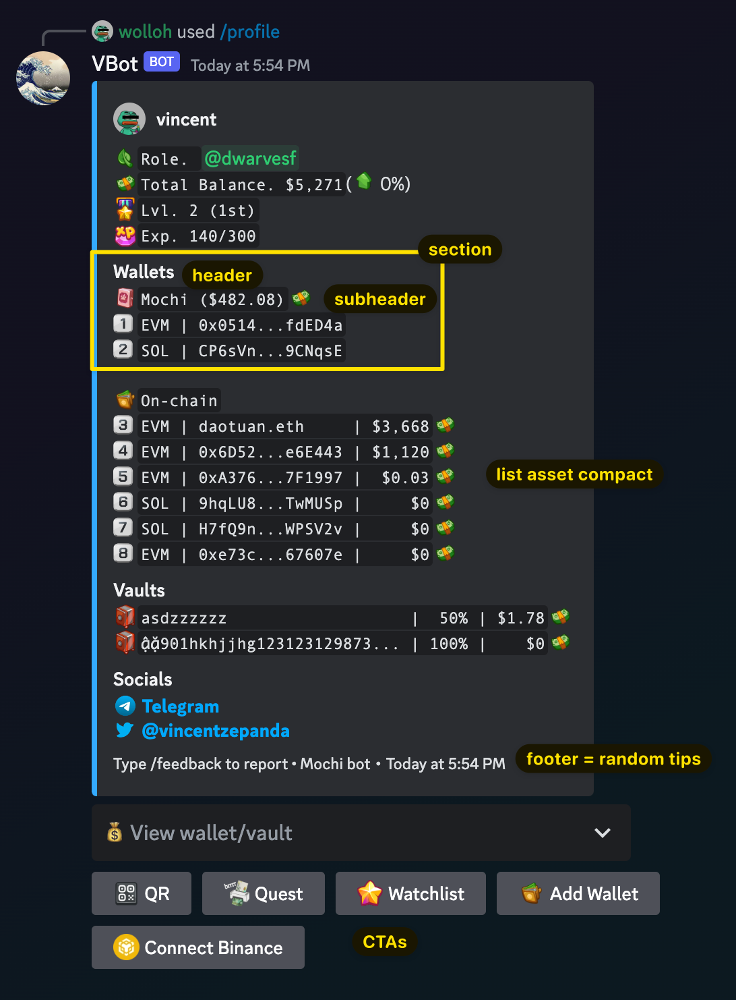
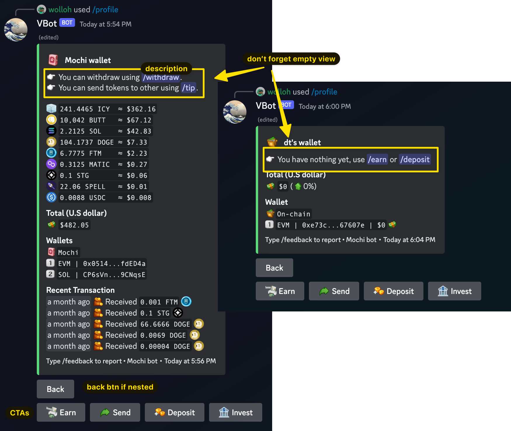
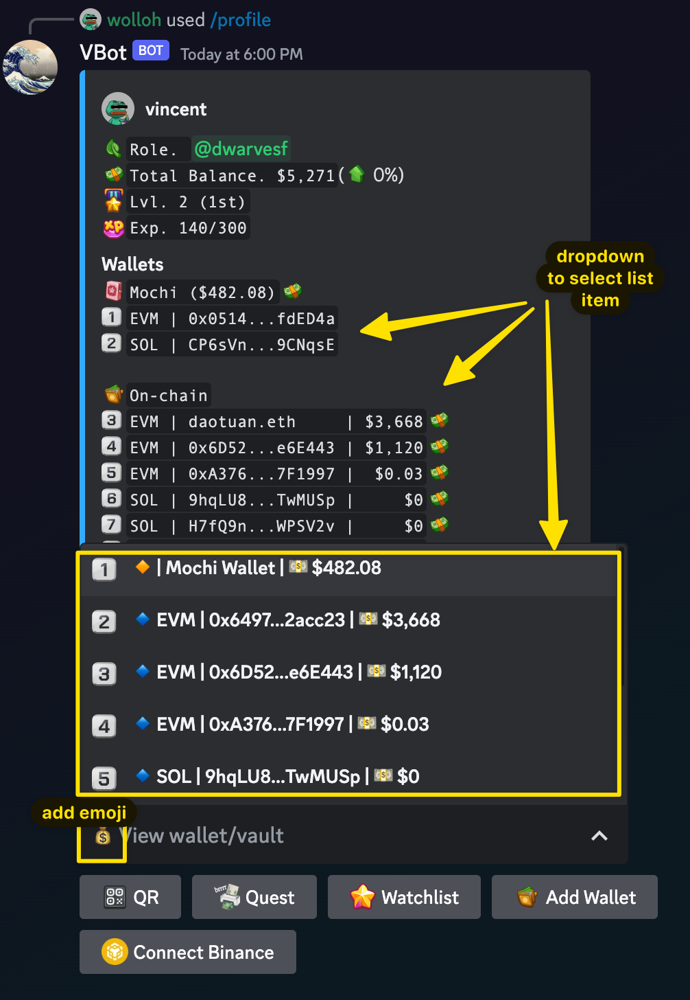

# Command guideline

## General

Whenever you create a new command or fine-tune existing ones, some rules must apply:

- Every embed should use `author` and not the `title` property
- Body must be an embed message
- Wrap callbacks in `wrapError`
- Use `composeEmbedMessage()` instead of `new MessageEmbed()`



### Section

A section = header + subheader (if any) + content, for content rendering, please use `formatDataTable()`

<details>
  <summary><code>formatDataTable(data: object[], options)</code></summary>

- `data` is an array of any object e.g. `[{token: "FTM", value: 10}, {...}]`
- `options` have the following shape:
  ```typescript
  {
    // required, specify the order in which columns are rendered
    // this will be typed to the keys of objects in `data` param
    cols: string[],
    // callback to add additional data to the formatted row string
    rowAfterFormatter?: (formatted: string, index: number) => string
    // Alignment = "left" | "center" | "right", index by `cols` order
    // default is putting all columns to the left except for the last column to the right
    alignment?: Alignment[]
    // separator used for each cols, index by `cols` order
    // default is "|"
    separator?: string[]
    // by default the row string is wrapped in backticks (\`\`) to preserve padding
    noWrap?: boolean
  }
  ```
- Examples
  ```javascript
  const output = formatDataTable(
    [
      {
        token: "10 ICY",
        usd: "15 USD",
      },
      {
        token: "200 FTM",
        value: "100 USD",
      },
      {
        token: "1000 BONK",
        value: "5 USD",
      },
    ],
    {
      cols: ["token", "value"],
      alignment: ["left", "right"],
      separator: ["≈"],
    },
  );
  console.log(output);
  // 10 ICY    ≈  15 USD
  // 200 FTM   ≈ 100 USD
  // 1000 BONK ≈   5 USD
  ```

</details>

### Footer

- With user avatar for personalized feedback
  `<avatar> <random_tip> • Mochi Bot • <timestamp>`

### Description/Empty view



### Message components

- Include CTA buttons/selects to guide user through commands
- Include back button when viewing nested content

  E.g. /profile -> view wallet -> back to /profile



## Success/Error

A ok/failed message response must have the following properties to be considered standard:

- If success, the color is BLUE `#34AAFF`
- If it is error 500 from backend, the color is RED `#D94F4F`
- If it is user error, the color is GRAY `#1E1F22`

The `composeEmbedMessage()` utility function can be used to quickly build an embed message
